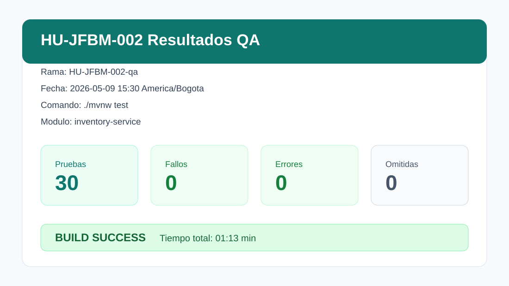
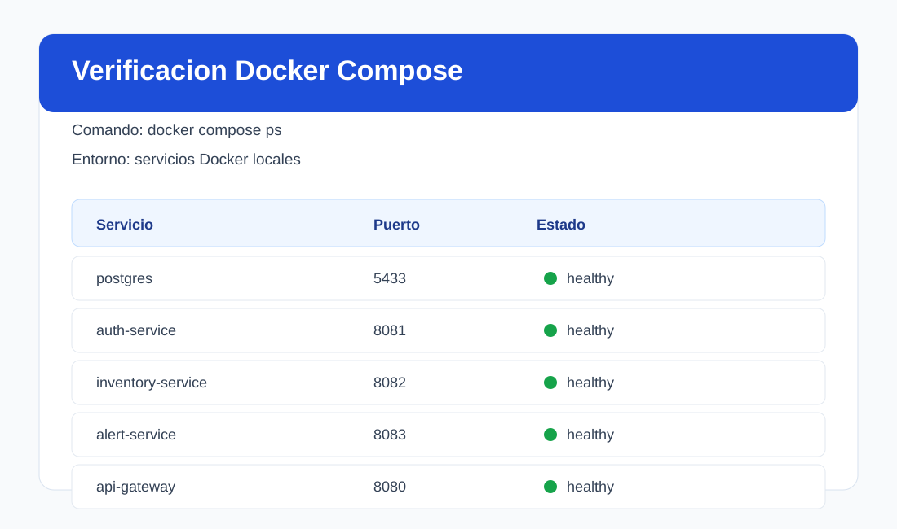
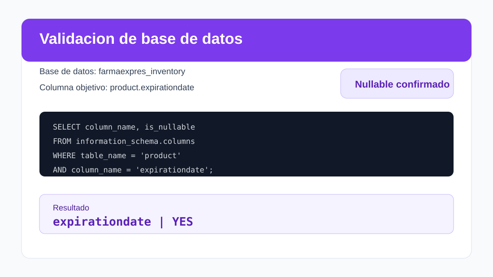

# HU-JFBM-002 - Evidencia de pruebas QA

## 1. Contexto
- Rama: `HU-JFBM-002-qa`
- Fecha de validacion: `2026-05-09`
- Entorno: stack local con Docker
- Componente principal validado: `inventory-service`
- Componentes relacionados: `postgres`, `api-gateway`, `auth-service`, `alert-service`

Este README documenta las pruebas y verificaciones ejecutadas para el flujo de validacion de `HU-JFBM-002`.

## 2. Evidencia visual

### Ejecucion de pruebas Maven


### Estado de servicios Docker


### Validacion de base de datos


## 3. Pruebas realizadas

### 3.1 Pruebas automatizadas del backend
Comando ejecutado desde `inventory-service`:

```bash
./mvnw test
```

Resultado:

```text
Tests run: 30, Failures: 0, Errors: 0, Skipped: 0
BUILD SUCCESS
Total time: 01:13 min
```

Grupos de prueba validados:
- `InventoryServiceApplicationTests`
- `productControllerIntegrationTest`
- `InventoryConcurrencyGuardTest`
- `JwtFilterTest`
- `MotionServiceTest`
- `ProductServiceTest`

### 3.2 Verificacion del entorno Docker
Comando ejecutado desde la raiz del repositorio:

```bash
docker compose ps
```

Resultado:

```text
postgres            healthy
auth-service        healthy
inventory-service   healthy
alert-service       healthy
api-gateway         healthy
```

### 3.3 Verificacion del esquema en PostgreSQL
Comando ejecutado desde la raiz del repositorio:

```bash
docker compose exec -T postgres psql -U postgres -d farmaexpres_inventory -c "SELECT column_name, is_nullable FROM information_schema.columns WHERE table_name = 'product' AND column_name = 'expirationdate';"
```

Resultado:

```text
column_name    | is_nullable
---------------+------------
expirationdate | YES
```

Esto confirma que la base de datos local permite que `product.expirationdate` sea nulo. Este comportamiento soporta el escenario en el que un producto queda sin lote activo consumible despues de registrar una salida total de inventario.

## 4. Evidencia de aceptacion
1. La suite de pruebas del backend para `inventory-service` paso correctamente.
2. Los servicios locales requeridos por el sistema estaban en ejecucion y saludables.
3. El esquema de base de datos acepto `expirationdate` como campo nullable.
4. La validacion respalda el comportamiento corregido para salidas totales de inventario sin forzar una proxima fecha de vencimiento.

## 5. Resultado final
La evidencia QA para `HU-JFBM-002` fue generada correctamente. Las pruebas automatizadas pasaron, los servicios locales estaban saludables y la verificacion del esquema de base de datos confirmo el comportamiento esperado para `product.expirationdate`.
